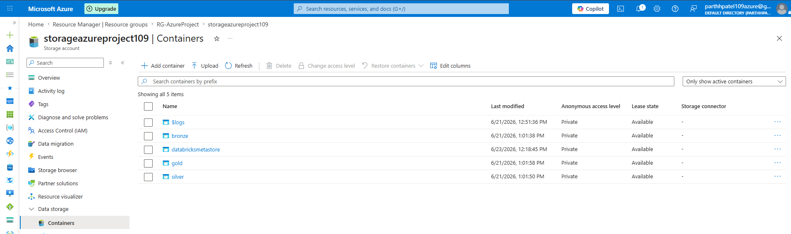
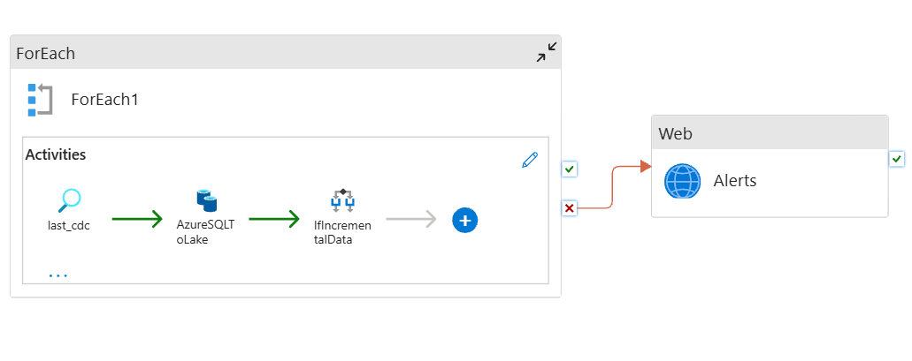
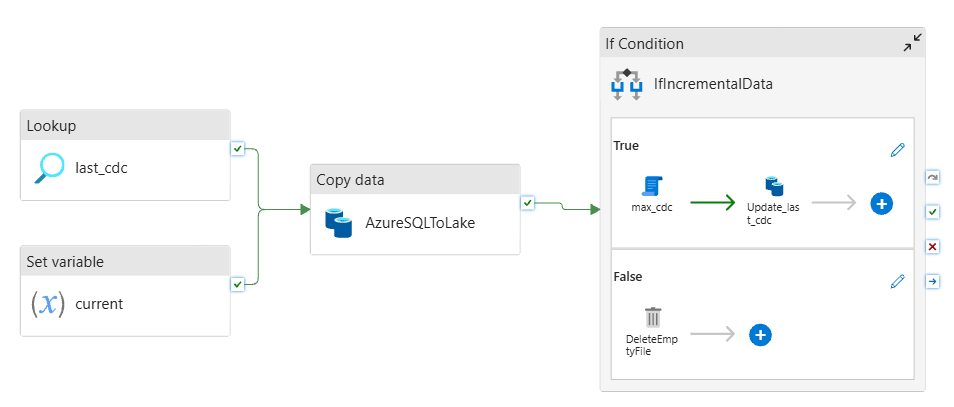
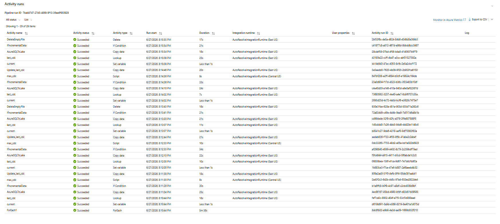
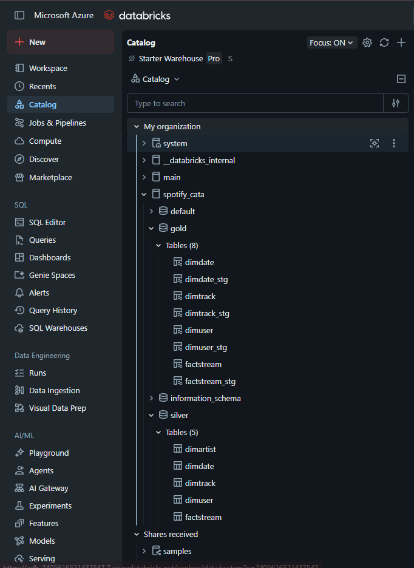
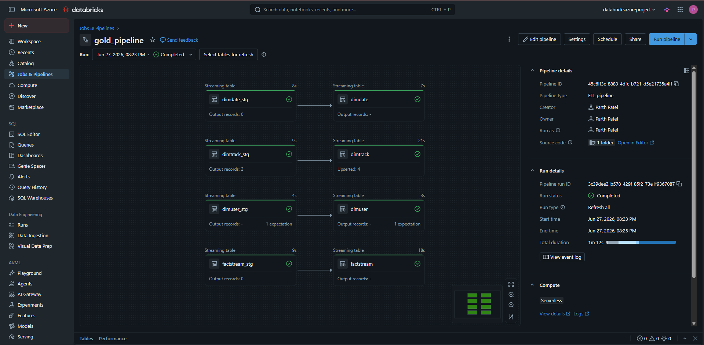

# 🎵 End-to-End Azure Data Engineering Project | Spotify Data Pipeline

## 📌 Project Overview

This project demonstrates the design and implementation of a modern **end-to-end Azure Data Engineering pipeline** using Microsoft Azure services and Azure Databricks.

The solution follows the **Medallion Architecture (Bronze → Silver → Gold)** to ingest, transform, govern, and curate Spotify streaming data for analytics. The pipeline leverages metadata-driven orchestration, incremental data loading, Delta Lake, and Slowly Changing Dimension (SCD Type 2) processing to simulate a real-world enterprise data platform.

The project showcases how raw operational data can be transformed into trusted, analytics-ready datasets using scalable cloud-native technologies.


## 🎯 Business Problem

Organizations receive continuous data from operational systems, but raw data alone cannot support reliable reporting or analytics.

Common challenges include:

- Manual ETL processes
- Poor data quality
- Lack of centralized storage
- No historical tracking of dimension changes
- Difficulty managing incremental data loads
- Limited governance and data lineage
- Inefficient pipelines that reload complete datasets

To address these challenges, this project implements a scalable Azure-based data platform capable of automatically ingesting, transforming, and maintaining historical data while preparing trusted datasets for downstream analytics.

## 💡 Solution Overview

The solution automates the complete data engineering lifecycle.

1. Azure Data Factory orchestrates metadata-driven incremental data ingestion.
2. Azure SQL Database serves as the operational source system.
3. Azure Data Lake Storage Gen2 stores data using the Medallion Architecture.
4. Azure Databricks processes raw data using PySpark and Auto Loader.
5. Delta Live Tables implement SCD Type 2 for Gold layer dimensions.
6. Unity Catalog provides centralized governance and metadata management.
7. Azure Logic Apps send automated email notifications when pipeline failures occur.

The final Gold layer contains curated business-ready datasets suitable for reporting, dashboards, and advanced analytics.


# 🏗️ Solution Architecture

> **Architecture Diagram**

<p align="center">
    
</p>


## 🔄 End-to-End Workflow

```text
Azure SQL Database
        │
        ▼
Azure Data Factory
(Metadata Driven Pipeline)
        │
        ▼
Azure Data Lake Storage Gen2
        │
        ▼
Bronze Layer
(Raw Data)
        │
        ▼
Azure Databricks
(PySpark + Auto Loader)
        │
        ▼
Silver Layer
(Cleansed & Standardized)
        │
        ▼
Delta Live Tables
(Auto CDC + SCD Type 2)
        │
        ▼
Gold Layer
(Business Ready Data)
        │
        ▼
Power BI / Analytics
```


# ☁️ Azure Resources

The complete solution is deployed on Microsoft Azure using multiple managed cloud services.

<p align="center">
    
</p>

### Azure Resources Used

| Azure Service | Purpose |
|--------------|---------|
| Azure SQL Database | Source system for Spotify datasets |
| Azure Data Factory | Metadata-driven orchestration and incremental ingestion |
| Azure Data Lake Storage Gen2 | Centralized data lake implementing Medallion Architecture |
| Azure Databricks | Distributed data processing using PySpark |
| Unity Catalog | Centralized governance and metadata management |
| Delta Live Tables | Gold layer processing and SCD Type 2 implementation |
| Azure Logic Apps | Email notifications for pipeline failures |
| GitHub | Version control and source code management |


# ⭐ Project Highlights

- Metadata-driven ETL pipeline
- Incremental Data Loading
- Medallion Architecture
- Azure Data Factory Orchestration
- Azure Databricks
- PySpark Transformations
- Auto Loader
- Delta Lake
- Delta Live Tables
- Slowly Changing Dimension (SCD Type 2)
- Unity Catalog
- Logic App Integration
- GitHub Version Control


# 📑 Table of Contents

- Project Overview
- Business Problem
- Solution Overview
- Solution Architecture
- Technology Stack
- Repository Structure
- Azure Resources
- Dataset
- Azure Data Factory
- Azure Data Lake Storage
- Azure Databricks
- Medallion Architecture
- Silver Layer Transformations
- Gold Layer (SCD Type 2)
- Delta Live Tables
- Unity Catalog
- Pipeline Monitoring
- Screenshots
- Challenges
- Skills Demonstrated
- Future Improvements
- How to Run
- Acknowledgements
- License

# 🛠️ Technology Stack

The project leverages a modern cloud-native data engineering stack built on Microsoft Azure.

| Category | Technology |
|----------|------------|
| Cloud Platform | Microsoft Azure |
| Data Ingestion | Azure Data Factory |
| Data Storage | Azure Data Lake Storage Gen2 |
| Source Database | Azure SQL Database |
| Data Processing | Azure Databricks |
| Programming Language | Python, PySpark |
| Streaming | Databricks Auto Loader |
| Data Format | Delta Lake |
| Data Transformation | PySpark |
| Data Quality | Delta Live Tables Expectations |
| Data Governance | Unity Catalog |
| Version Control | GitHub |
| Alerting | Azure Logic Apps |


# ☁️ Azure Services Used

This solution integrates multiple Azure services to build a scalable, secure, and enterprise-ready data platform.

| Service | Purpose |
|----------|---------|
| **Azure SQL Database** | Stores the source Spotify datasets. |
| **Azure Data Factory** | Orchestrates metadata-driven incremental data ingestion pipelines. |
| **Azure Data Lake Storage Gen2** | Centralized storage implementing Bronze, Silver, and Gold layers. |
| **Azure Databricks** | Performs distributed data processing and transformations using PySpark. |
| **Delta Live Tables** | Automates Gold layer processing and implements Slowly Changing Dimension (SCD Type 2). |
| **Unity Catalog** | Provides centralized governance, metadata management, and access control. |
| **Azure Logic Apps** | Sends automated email notifications whenever pipeline failures occur. |
| **GitHub** | Stores source code and enables version control. |

# 🎵 Dataset

This project uses a Spotify music streaming dataset consisting of dimension and fact tables.

| Table | Description |
|--------|-------------|
| **DimUser** | User information and profile details. |
| **DimArtist** | Artist master data. |
| **DimTrack** | Track metadata including duration and popularity. |
| **DimDate** | Date dimension used for analytical reporting. |
| **FactStream** | Music streaming transaction records. |

The dataset simulates a real-world analytical environment where streaming events are continuously generated and incrementally processed through the Azure Data Engineering pipeline.


# 🏗️ Medallion Architecture

The solution follows the Medallion Architecture to progressively improve data quality.

<p align="center">
    
</p>

| Layer | Description |
|--------|-------------|
| 🥉 **Bronze** | Stores raw source data exactly as received from Azure SQL Database. |
| 🥈 **Silver** | Stores cleaned, validated, and transformed Delta tables using PySpark. |
| 🥇 **Gold** | Stores business-ready curated datasets with SCD Type 2 implementation for reporting and analytics. |

### Benefits

- Data quality improves at every layer.
- Raw data remains immutable.
- Easy reprocessing of historical data.
- Supports incremental processing.
- Optimized for Business Intelligence and Machine Learning.


# 🔄 End-to-End Data Flow

The project automates the complete data engineering lifecycle from ingestion to analytics.

```text
Azure SQL Database
        │
        ▼
Azure Data Factory
        │
        ▼
Lookup Metadata
        │
        ▼
Incremental Data Extraction
        │
        ▼
Azure Data Lake Storage (Bronze)
        │
        ▼
Azure Databricks Auto Loader
        │
        ▼
Silver Layer Transformations
        │
        ▼
Delta Live Tables
        │
        ▼
Gold Layer (SCD Type 2)
        │
        ▼
Analytics / Reporting
```


# 📂 Azure Data Lake Storage Gen2

Azure Data Lake Storage Gen2 acts as the centralized storage layer for the project.

<p align="center">
    
</p>

### Storage Containers

| Container | Purpose |
|------------|----------|
| **bronze** | Stores raw data ingested from Azure SQL Database. |
| **silver** | Stores cleansed and standardized Delta tables after PySpark transformations. |
| **gold** | Stores curated business-ready datasets optimized for reporting and analytics. |
| **databricksmetastore** | Stores Unity Catalog metadata and Databricks managed objects. |
| **$logs** | Azure Storage diagnostic logs. |

The Medallion Architecture ensures data quality improves as it progresses from Bronze to Gold while preserving historical raw data for auditing and reprocessing.

# 🔄 Azure Data Factory (ADF)

Azure Data Factory serves as the orchestration layer of the solution. It automates the ingestion of data from Azure SQL Database into Azure Data Lake Storage Gen2 using a **metadata-driven incremental loading strategy**.

Unlike traditional ETL pipelines that require a separate pipeline for each table, this project uses a **single reusable pipeline** capable of processing multiple source tables dynamically.

<p align="center">
    
</p>


## 📌 Pipeline Architecture

The pipeline consists of the following activities:

| Activity | Purpose |
|----------|---------|
| **ForEach** | Iterates through each source table defined in metadata. |
| **Lookup** | Retrieves the last processed CDC value from the metadata table. |
| **Set Variable** | Stores the current execution timestamp for metadata updates. |
| **Copy Data** | Copies only newly inserted or updated records from Azure SQL Database to the Bronze layer. |
| **If Condition** | Checks whether incremental data exists. |
| **Script Activity** | Retrieves the latest CDC value after successful ingestion. |
| **Update Metadata** | Updates the metadata table with the latest processed CDC value. |
| **Delete Activity** | Removes temporary files when no new records are available. |
| **Web Activity** | Invokes Azure Logic Apps to send email notifications on pipeline failures. |


## 📷 Pipeline Details

<p align="center">
    
</p>

The pipeline is fully parameterized, making it reusable for multiple source tables while minimizing maintenance effort.


# ⚡ Metadata-Driven ETL

Rather than hardcoding source tables inside the pipeline, the solution reads metadata and dynamically processes each table using a **ForEach** activity.

### Metadata includes

- Source Schema
- Source Table
- Watermark / CDC Column
- Destination Path
- Load Type

This design enables onboarding new tables by simply updating the metadata instead of modifying the pipeline.

### Advantages

- Reusable pipelines
- Easy maintenance
- Reduced development effort
- Scalable architecture
- Supports multiple datasets


# 📈 Incremental Data Loading Strategy

The pipeline implements an incremental loading mechanism to process only newly inserted or modified records.

### Workflow

```text
Pipeline Starts
        │
        ▼
Read Last CDC Value
        │
        ▼
Query Azure SQL
WHERE updated_at > last_cdc
        │
        ▼
Copy Incremental Records
        │
        ▼
Write to Bronze Layer
        │
        ▼
Get Latest CDC Value
        │
        ▼
Update Metadata Table
        │
        ▼
Pipeline Ends
```

### Benefits

- Faster execution
- Reduced storage usage
- Lower compute cost
- Avoids duplicate processing
- Suitable for large-scale datasets


# 🗃️ Azure SQL Database

Azure SQL Database acts as the operational source system for the project.

The source contains both **dimension** and **fact** tables used throughout the ETL process.

### Source Tables

| Table | Description |
|--------|-------------|
| DimUser | User information |
| DimArtist | Artist details |
| DimTrack | Track metadata |
| DimDate | Date dimension |
| FactStream | Streaming transaction records |

Each table contains an **updated_at** column, which is used as the watermark for incremental loading.


# 🪵 Bronze Layer

The Bronze layer stores raw data exactly as received from the source system.

Characteristics:

- Raw parquet files
- No transformations
- Historical data preserved
- Incremental ingestion
- Source of truth

The Bronze layer enables data replay, auditing, and recovery if downstream processing fails.


# 📧 Azure Logic Apps Integration

The pipeline integrates Azure Logic Apps for automated failure notifications.

Whenever a pipeline activity fails, Azure Data Factory invokes a Logic App through a Web Activity, triggering an email notification containing pipeline execution details.

### Notification includes

- Pipeline Name
- Pipeline Run ID
- Failure Status
- Execution Time
- Error Details

This provides proactive monitoring and reduces response time for operational issues.


# 📊 Pipeline Monitoring

Azure Data Factory provides centralized monitoring for every pipeline execution.

<p align="center">
    
</p>

The monitoring dashboard provides:

- Pipeline execution history
- Activity-level status
- Execution duration
- Integration Runtime
- Success and failure tracking
- Error diagnostics

Monitoring enables quick identification of failed activities while providing complete operational visibility into the ETL process.


# ✅ Key Azure Data Factory Features Implemented

- Metadata-driven pipeline
- Incremental loading
- Dynamic parameterization
- ForEach processing
- Lookup activity
- Copy Data activity
- Script activity
- Conditional branching
- Metadata management
- Pipeline monitoring
- Failure notifications
- Azure Logic Apps integration


# 🚀 Azure Databricks

Azure Databricks is the core data processing engine of this project. It performs distributed data transformation using **PySpark**, processes streaming data with **Auto Loader**, and builds analytics-ready datasets following the **Medallion Architecture**.

The Databricks workspace is organized using **Unity Catalog**, which provides centralized governance and metadata management across all layers.

<p align="center">
    
</p>


# 📚 Unity Catalog

Unity Catalog provides centralized governance for all data assets created within the Databricks workspace.

The project organizes data into dedicated schemas for each Medallion layer.

### Catalog Structure

```text
spotify_cata
│
├── silver
│   ├── dimartist
│   ├── dimdate
│   ├── dimtrack
│   ├── dimuser
│   └── factstream
│
└── gold
    ├── dimdate
    ├── dimdate_stg
    ├── dimtrack
    ├── dimtrack_stg
    ├── dimuser
    ├── dimuser_stg
    ├── factstream
    └── factstream_stg
```

### Benefits

- Centralized Metadata Management
- Data Governance
- Access Control
- Data Discovery
- Secure Table Management
- Simplified Collaboration

Unity Catalog acts as the single source of truth for all Delta tables within the project.


# ⚡ Databricks Auto Loader

The project uses **Databricks Auto Loader** to continuously ingest new files from the Bronze layer into the Silver layer.

Auto Loader automatically detects newly arrived files without requiring full directory scans, making it highly scalable for large datasets.

### Auto Loader Features

- Incremental file ingestion
- Automatic schema inference
- Schema evolution
- Fault tolerance using checkpoints
- Optimized cloud file discovery
- Streaming ingestion

### Processing Workflow

```text
Bronze Container
        │
        ▼
Auto Loader
(cloudFiles)
        │
        ▼
PySpark Streaming
        │
        ▼
Business Transformations
        │
        ▼
Silver Delta Tables
```


# 🥈 Silver Layer

The Silver layer transforms raw Bronze data into clean, standardized, and analytics-ready datasets.

All transformations are implemented using **PySpark Structured Streaming**, ensuring scalable and incremental processing.

### Responsibilities

- Data cleansing
- Data validation
- Standardization
- Business transformations
- Schema enforcement
- Delta table creation


## Business Transformations

### DimUser

- Converts user names to uppercase
- Cleans and standardizes user attributes

### DimTrack

- Removes unwanted characters from track names
- Creates a derived **Duration Category** (Low, Medium, High)

### DimArtist

- Cleans artist information
- Standardizes dimension records

### DimDate

- Prepares reporting-friendly date dimension

### FactStream

- Processes streaming transaction records
- Standardizes streaming metrics


## Silver Layer Output

| Table | Purpose |
|--------|---------|
| dimuser | Standardized user dimension |
| dimartist | Artist master data |
| dimtrack | Track metadata |
| dimdate | Calendar dimension |
| factstream | Streaming fact table |

All Silver datasets are stored as **Delta Tables** inside Azure Data Lake Storage Gen2.


# 🥇 Gold Layer

The Gold layer contains business-ready datasets optimized for analytics and reporting.

Unlike the Silver layer, the Gold layer focuses on maintaining historical records using **Slowly Changing Dimension Type 2 (SCD Type 2)**.


# 🔄 Delta Live Tables (DLT)

The Gold layer is implemented using **Delta Live Tables**, which simplifies streaming ETL, enforces data quality rules, and automates dependency management.

<p align="center">
    
</p>

### Pipeline Components

- dimdate
- dimtrack
- dimuser
- factstream

Each dataset contains:

- Streaming Staging Table
- Final Gold Table


## Data Quality Expectations

Before processing data into Gold tables, Delta Live Tables validates incoming records.

Example validations include:

- Primary Key cannot be NULL
- Invalid records are automatically dropped
- Streaming tables remain clean
- Data quality is continuously enforced

This ensures only trusted records reach downstream analytics.


# 🔁 Slowly Changing Dimension (SCD Type 2)

The project implements **SCD Type 2** using **DLT Auto CDC**.

Instead of overwriting existing records, historical versions are preserved whenever changes occur.

### Workflow

```text
Silver Table
        │
        ▼
Streaming Staging Table
        │
        ▼
Auto CDC
        │
        ▼
Compare Business Key
        │
        ▼
Existing Record?
        │
 ┌──────┴────────┐
 │               │
 ▼               ▼
Insert       Expire Previous
New Row      Insert Updated Row
        │
        ▼
Gold Dimension
```

### Business Key

- user_id

### Sequence Column

- updated_at

### Benefits

- Historical tracking
- Auditability
- Change history
- Point-in-time reporting
- Regulatory compliance


# 📊 Gold Layer Output

| Table | Description |
|--------|-------------|
| dimuser | Historical user dimension |
| dimtrack | Historical track dimension |
| dimdate | Date dimension |
| factstream | Curated streaming facts |

These Gold tables are optimized for downstream reporting and Business Intelligence tools.


# ⭐ Databricks Features Implemented

- Azure Databricks
- PySpark
- Structured Streaming
- Databricks Auto Loader
- Delta Lake
- Unity Catalog
- Delta Live Tables
- Auto CDC
- Data Quality Expectations
- Streaming Tables
- Checkpointing
- SCD Type 2
- Business Transformations
- Incremental Processing


  
